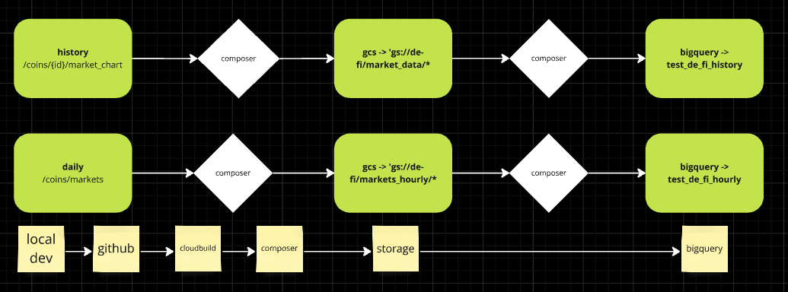

**Project Overview**

Analytics project for decentralised finance using data from coingecko.



[**Set up Infrastructure**](https://github.com/Otobi1/de-fi-analytics/blob/master/terraform/main.tf)
```
Provision and manage
- cloudbuild
- composer
- storage
- vm
- bigquery dataset
```

[**Cloudbuild Config**](https://github.com/Otobi1/de-fi-analytics/blob/master/cloudbuild.yaml)

> Defined build steps including how to get the files from github into composer environment

**Ingest Data into GCS**

[**History**](https://github.com/Otobi1/de-fi-analytics/blob/master/scripts/ingest_history.py) and [**DAG**](https://github.com/Otobi1/de-fi-analytics/blob/master/dags/de_fi_history_coingecko_ingest.py)
> Ingest partitioned history data for the top 100 crypto coins into GCS. 

[**Hourly**](https://github.com/Otobi1/de-fi-analytics/blob/master/scripts/ingest_hourly.py) and [**DAG**](https://github.com/Otobi1/de-fi-analytics/blob/master/dags/de_fi_hourly_coingecko_ingest.py)
> Ingest partitioned and clustered hourly data for the top 100 coins into GCS

**Outcome**
> * Overcame the limitation from the [trad-fi-analytics](https://github.com/Otobi1/trad-fi-analytics) by automating the data ingestion and publishing to Bigquery using cloudbuild and composer.

**Limitation**
> * Composer is quite expensive, exhausted the free credits very quickly even at a lower resource usage tier
> * Transformations and reporting was not possible due to the exhaustion of the credits.